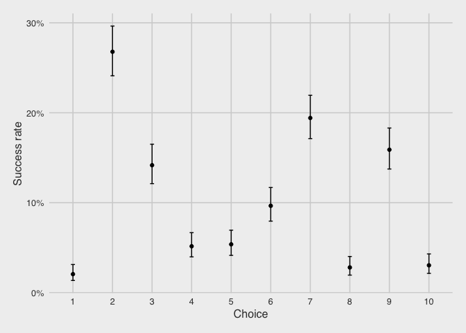
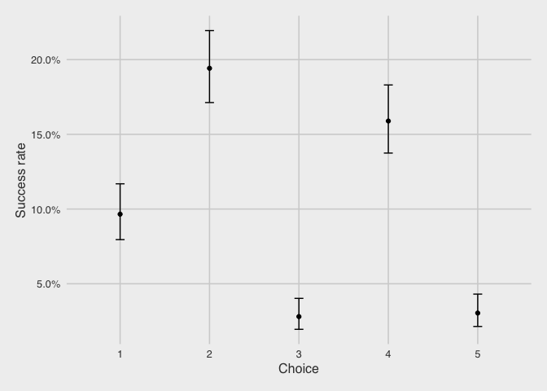

Contextual bandit example - data preparation
================

Introduction
------------

Here, we will use doubly robust offline evaluation to compare various
bandit policies (A/B testing, MAB, CB). The dataset used here is from
the [“Machine Learning for Personalization”
course](http://www.cs.columbia.edu/~jebara/6998/)

Raw data
--------

The raw data contains 10k rows with a choice (from 10 options), a binary
reward, and 100 context features.

<!-- -->

| choice |    n |  prop |
|-------:|-----:|------:|
|      1 | 1020 | 0.102 |
|      2 |  982 | 0.098 |
|      3 |  974 | 0.097 |
|      4 | 1047 | 0.105 |
|      5 | 1005 | 0.100 |
|      6 |  963 | 0.096 |
|      7 | 1035 | 0.104 |
|      8 |  999 | 0.100 |
|      9 |  988 | 0.099 |
|     10 |  987 | 0.099 |

| reward |    n |  prop |
|-------:|-----:|------:|
|      0 | 8961 | 0.896 |
|      1 | 1039 | 0.104 |

Data for simulation
-------------------

However, in this example, we will only consider observations involving
arms 6-10 (4972 rows), which we rename as arms 1-5.

    ## [1] 4972  103

<!-- -->

| choice |    n |  prop |
|-------:|-----:|------:|
|      1 |  963 | 0.194 |
|      2 | 1035 | 0.208 |
|      3 |  999 | 0.201 |
|      4 |  988 | 0.199 |
|      5 |  987 | 0.199 |

| reward |    n |  prop |
|-------:|-----:|------:|
|      0 | 4463 | 0.898 |
|      1 |  509 | 0.102 |
