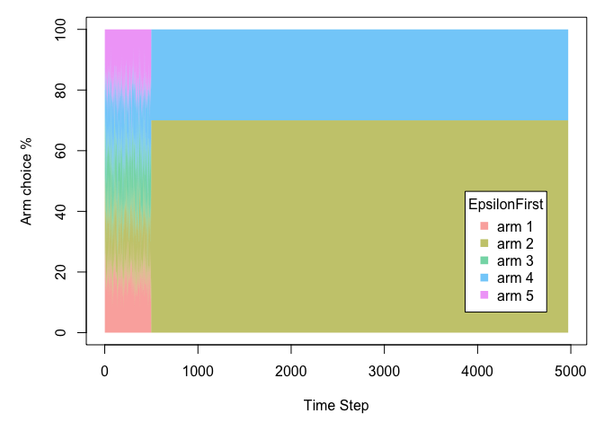
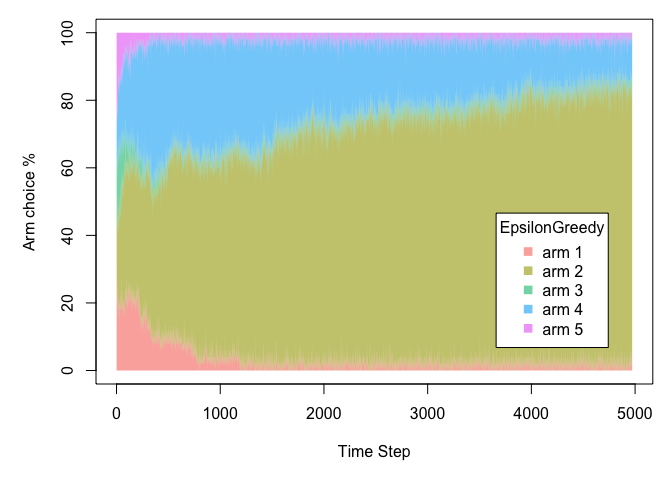
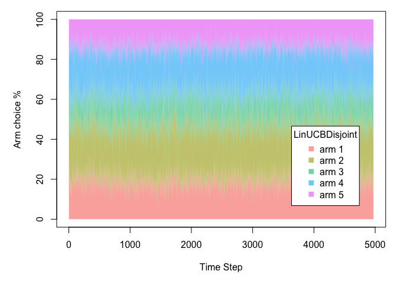
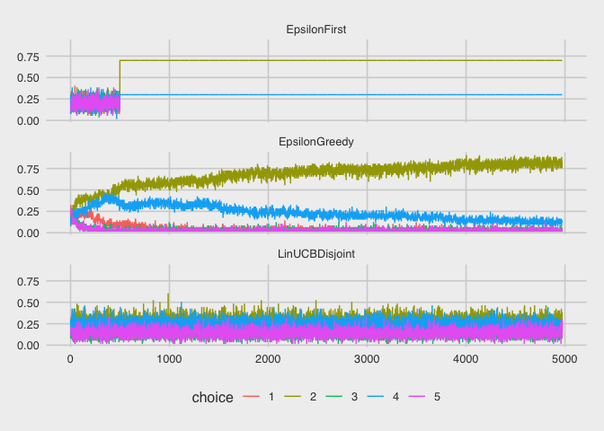
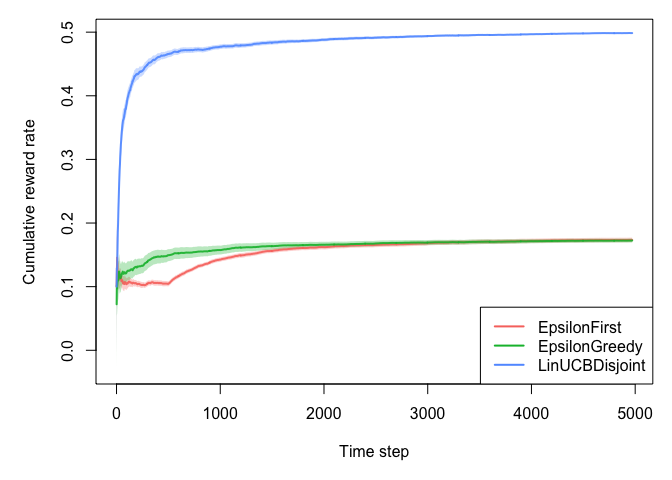

Contextual bandit example - run simulation
================

Required inputs
---------------

We will replay the `EpsilonFirstPolicy` (A/B testing),
`EpsilonGreedyPolicy` (MAB) , and `LinUCBDisjointPolicy` (CB) policies
over this data using the `OfflineDoublyRobustBandit`.

However, the `OfflineDoublyRobustBandit` requires:

1.  Fitting a model to the data, as in the direct method
2.  Propensities per arm, as in the inverse propensity score method. The
    Doubly Robust Bandit uses the marginal probabilities per arm if
    these are omitted.

### Fit DM model

We fit a logistic regression to each arm, and use it to produce a
predicted reward for each observation for each arm.

    ## # A tibble: 6 x 7
    ##   choice reward      r1      r2      r3      r4      r5
    ##    <dbl>  <dbl>   <dbl>   <dbl>   <dbl>   <dbl>   <dbl>
    ## 1      3      0 0.0271  0.964   0.0188  0.0358  0.0386 
    ## 2      4      0 0.0411  0.0346  0.0366  0.0240  0.0533 
    ## 3      4      0 0.0136  0.0127  0.0117  0.00557 0.00789
    ## 4      4      0 0.00961 0.0156  0.00911 0.0106  0.0122 
    ## 5      3      0 0.0221  0.00597 0.0117  0.0136  0.0192 
    ## 6      2      0 0.0111  0.00682 0.00888 0.00283 0.00836

### Fit IPS probabilities

We could fit a model to predict arm probabilities, but for now we’ll
just default to the marginal probabilities.

Doubly robust evaluation
------------------------

Evaluation policy
-----------------

The policies to be evaluated here are `EpsilonFirstPolicy`,
`EpsilonGreedyPolicy`, and `LinUCBDisjointPolicy`.

    agents <-list(
        Agent$new(EpsilonFirstPolicy$new(epsilon = 0.1, N = horizon), bandit_dr),
        Agent$new(EpsilonGreedyPolicy$new(epsilon = 0.1), bandit_dr),
        Agent$new(LinUCBDisjointPolicy$new(0.01), bandit_dr)
        )

Results
-------

    ## 
    ## Agents:
    ## 
    ##   EpsilonFirst,   EpsilonGreedy,   LinUCBDisjoint
    ## 
    ## Cumulative regret:
    ## 
    ##           agent    t sims cum_regret cum_regret_var cum_regret_sd
    ##    EpsilonFirst 4972   50         NA             NA            NA
    ##   EpsilonGreedy 4972   50         NA             NA            NA
    ##  LinUCBDisjoint 4972   50         NA             NA            NA
    ## 
    ## 
    ## Cumulative reward:
    ## 
    ##           agent    t sims cum_reward cum_reward_var cum_reward_sd
    ##    EpsilonFirst 4972   50   862.5657     4078.55366     63.863555
    ##   EpsilonGreedy 4972   50   857.6562     2940.20610     54.223667
    ##  LinUCBDisjoint 4972   50  2478.6382       42.16934      6.493792
    ## 
    ## 
    ## Cumulative reward rate:
    ## 
    ##           agent    t sims cur_reward cur_reward_var cur_reward_sd
    ##    EpsilonFirst 4972   50  0.1734847    0.820304438   0.012844641
    ##   EpsilonGreedy 4972   50  0.1724972    0.591352796   0.010905806
    ##  LinUCBDisjoint 4972   50  0.4985193    0.008481363   0.001306072

Plots
-----

### Arm choices

<!-- --><!-- --><!-- -->

    ## `summarise()` regrouping output by 't', 'choice' (override with `.groups` argument)

<!-- -->

### Cumulative reward

<!-- -->
